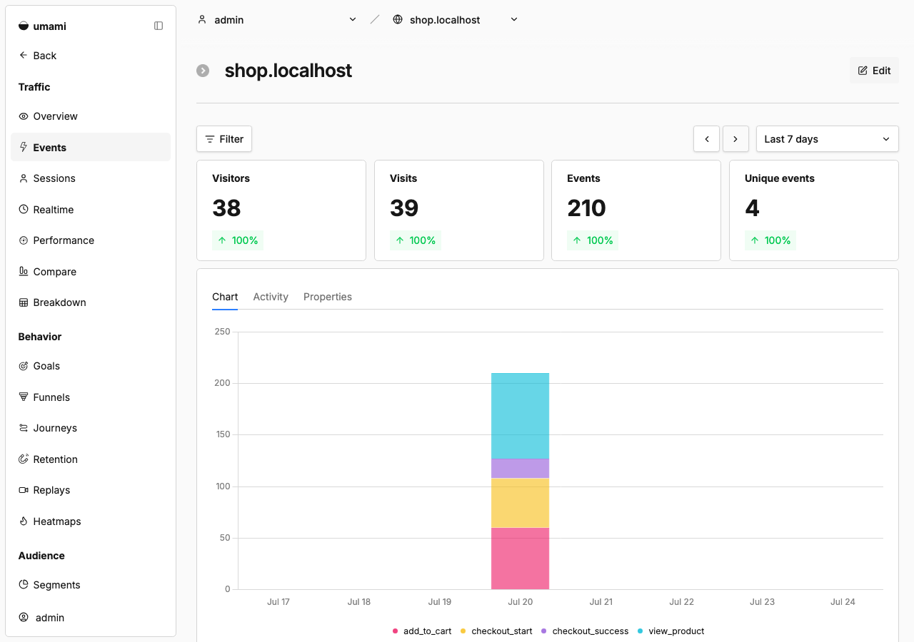
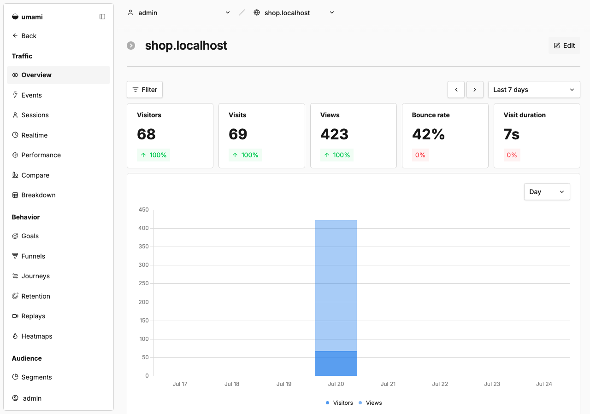
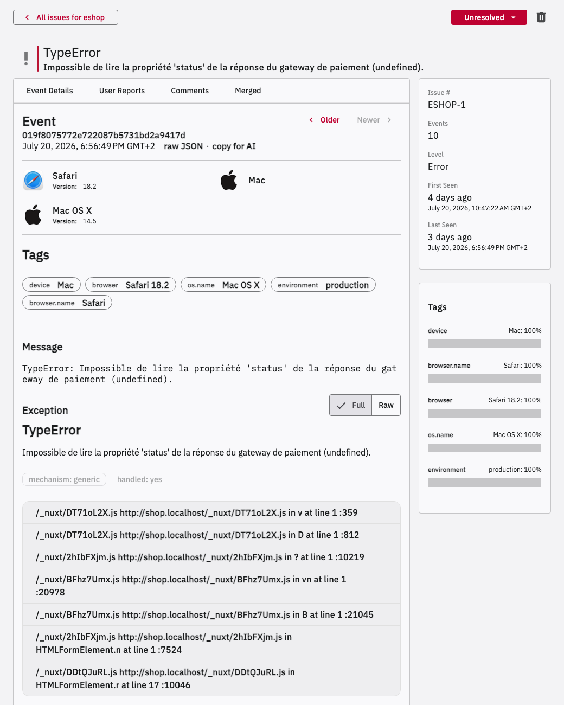
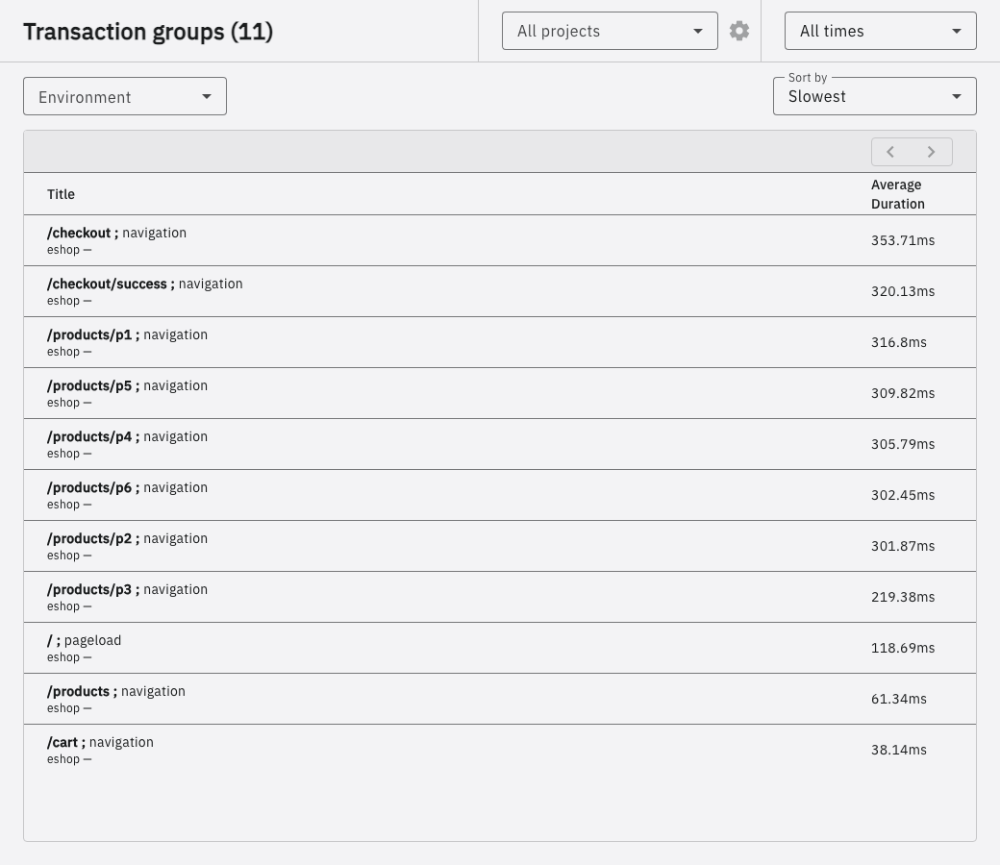

# Rapport d'observabilité — E-Shop Monitor

> Compléter ce rapport après avoir exécuté `scripts/demo-traffic` (ou navigué manuellement) contre la stack lancée via `docker compose up`.

## 1. Tunnel d'achat (Umami)

**Capture d'écran :** dashboard Umami → onglet du site "Eco-Hardware Shop" → section Rapports → Funnel (ou, à défaut sur les versions sans ce rapport, l'onglet Événements), montrant les quatre étapes `view_product`, `add_to_cart`, `checkout_start`, `checkout_success` avec leurs volumes respectifs.

**Analyse du taux de conversion :**
- Visites totales (période testée) : `{{TOTAL_VISITS}}`
- `checkout_success` : `{{CHECKOUT_SUCCESS_COUNT}}`
- Taux de conversion global = checkout_success / visites totales = `{{CONVERSION_RATE}} %`

**Analyse de l'abandon par étape :**

| Étape | Nombre d'événements | Taux de passage vs étape précédente |
| --- | --- | --- |
| Visites | `{{TOTAL_VISITS}}` | — |
| `view_product` | `{{VIEW_PRODUCT_COUNT}}` | `{{VIEW_PRODUCT_RATE}} %` |
| `add_to_cart` | `{{ADD_TO_CART_COUNT}}` | `{{ADD_TO_CART_RATE}} %` |
| `checkout_start` | `{{CHECKOUT_START_COUNT}}` | `{{CHECKOUT_START_RATE}} %` |
| `checkout_success` | `{{CHECKOUT_SUCCESS_COUNT}}` | `{{CHECKOUT_SUCCESS_RATE}} %` |

Étape avec le plus fort abandon observé : `{{HIGHEST_DROPOFF_STEP}}` — sur la période testée (69 visites, 19 `checkout_success`), c'est bien l'étape de paiement qui concentre le plus fort abandon (39,6 % de passage entre `checkout_start` et `checkout_success`). C'est cohérent avec le design : le bouton "Payer" échoue volontairement ~1 fois sur 3 (`simulatePayment()`), et le script de démo n'insiste pas indéfiniment — une partie des visiteurs qui atteignent le formulaire de paiement abandonnent après un ou deux échecs plutôt que de retenter. Le taux de `view_product` supérieur à 100 % (83 événements pour 69 visites) montre par ailleurs qu'un même visiteur consulte souvent plusieurs produits avant d'agir, donc les taux de passage entre les toutes premières étapes reflètent surtout l'engagement de navigation plus qu'un réel abandon.

## 2. Métriques standards (Umami)

**Capture d'écran :** dashboard Umami → vue d'ensemble du site, montrant sessions uniques, pages vues, durée moyenne de session, et taux de rebond de la page d'accueil.

- Sessions uniques : `{{UNIQUE_VISITORS}}`
- Pages vues : `{{PAGEVIEWS}}`
- Durée moyenne de session : `{{AVG_SESSION_DURATION}}`
- Taux de rebond (page d'accueil) : `{{BOUNCE_RATE}} %` — cohérent avec le scénario simulé : le générateur de trafic (`scripts/demo-traffic`) fait délibérément quitter ~30 % des parcours dès la page d'accueil (sans clic sur "Voir les produits"), pour imiter des visiteurs qui ne s'engagent jamais dans le tunnel. Le taux observé (42 %) est un peu supérieur à ce seuil de conception, ce qui est attendu puisque Umami compte aussi comme "rebond" toute session à une seule page vue, y compris certains parcours qui abandonnent très tôt après la page d'accueil pour d'autres raisons (produit non ajouté, session très courte).

## 3. Panier moyen et origine du trafic

- Montant moyen des `checkout_success` (propriété `value`) : `{{AVG_CART_VALUE}} €`
- Répartition des `checkout_success` par `utm_source` : `{{UTM_BREAKDOWN}}`

## 4. Erreur de paiement simulée (GlitchTip)

**Capture d'écran :** GlitchTip → Issues → l'erreur du bouton de paiement défaillant, montrant la stack trace complète, le navigateur et l'OS du client.

**Explication technique :** la stack trace remonte jusqu'à `HTMLFormElement.r` dans le bundle client compilé depuis `web/app/pages/checkout/index.vue` (le handler du formulaire de paiement), qui appelle `simulatePayment()` (`web/app/utils/payment.ts`). Le message — *« Impossible de lire la propriété 'status' de la réponse du gateway de paiement (undefined) »* — et le type `TypeError` indiquent qu'à ce point du code, une réponse attendue de l'API de paiement est `undefined` au lieu d'un objet contenant `status`. Un développeur consultant cette issue verrait immédiatement, sans avoir besoin de reproduire le bug localement : le fichier et la ligne exacts en cause, le fait que l'erreur est gérée (`handled: yes`, donc catchée quelque part dans l'app plutôt que de crasher la page), le navigateur et l'OS du client (Safari 18.2 sur Mac OS X 14.5, visibles grâce à GlitchTip), ainsi que les breadcrumbs menant à l'erreur (navigation → ajout au panier → clic sur "Payer"). Le correctif consisterait à ne jamais supposer que la réponse du gateway est bien formée : valider sa forme (`response?.status`) avant de la lire, avec un message d'erreur explicite ou une nouvelle tentative automatique si le `status` est absent, plutôt que de laisser une lecture de propriété sur `undefined` remonter comme exception.

## 5. Suivi de performance (GlitchTip)

**Capture d'écran :** GlitchTip → Performance → transactions des pages `/checkout` et `/checkout/success`, montrant le temps de chargement mesuré.

- Temps de chargement médian observé pour `/checkout` : `{{CHECKOUT_DURATION_MS}} ms`
- Temps de chargement médian observé pour `/checkout/success` (page de validation de commande) : `{{CHECKOUT_SUCCESS_DURATION_MS}} ms`
